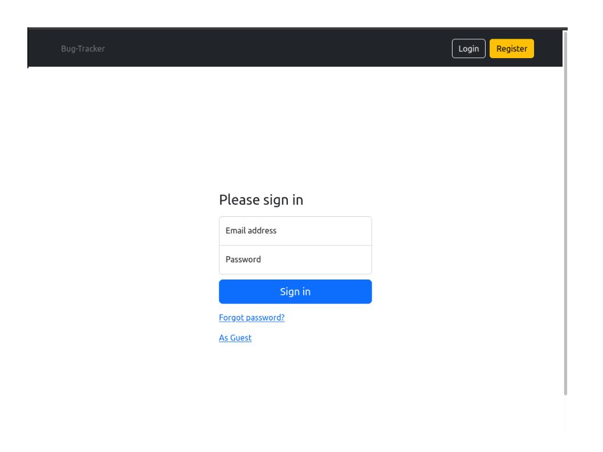
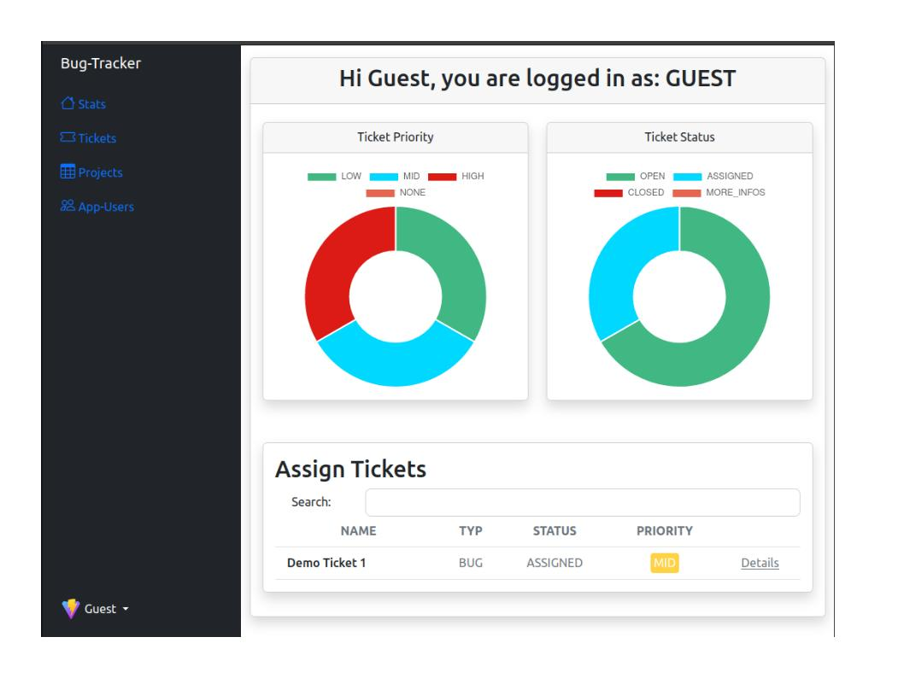
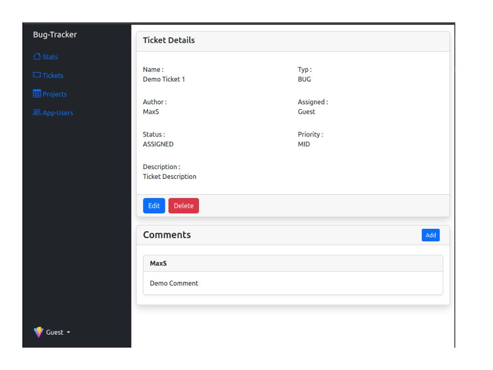
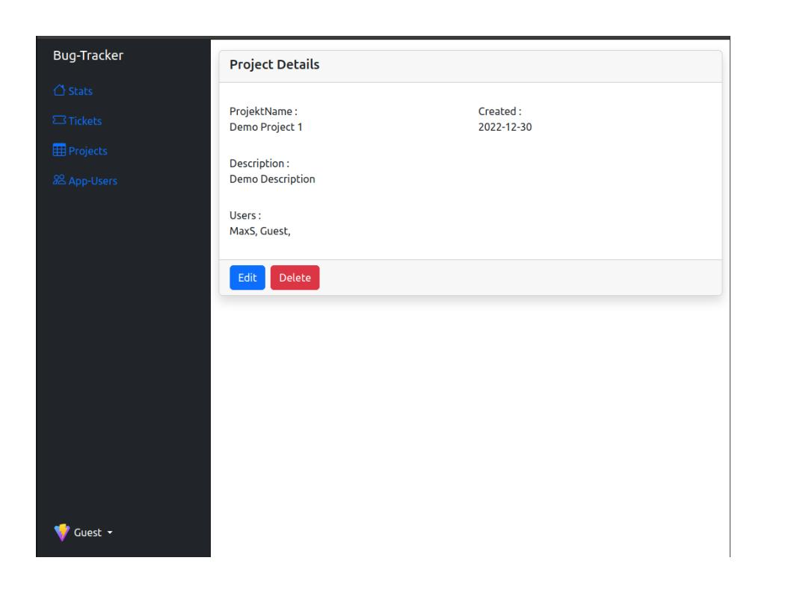
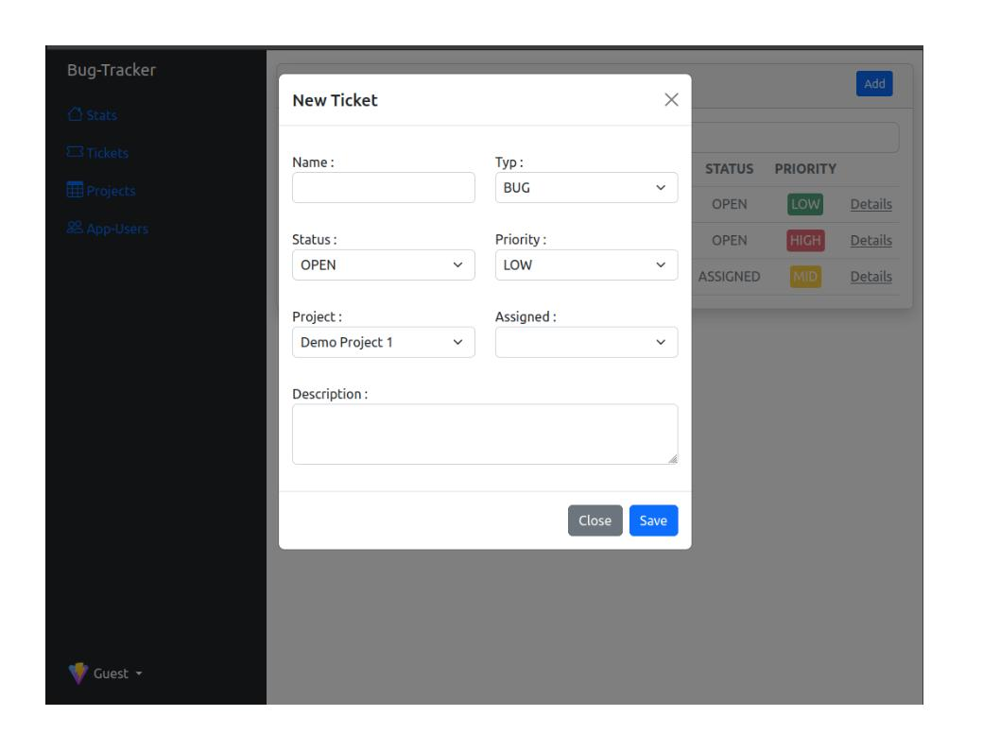
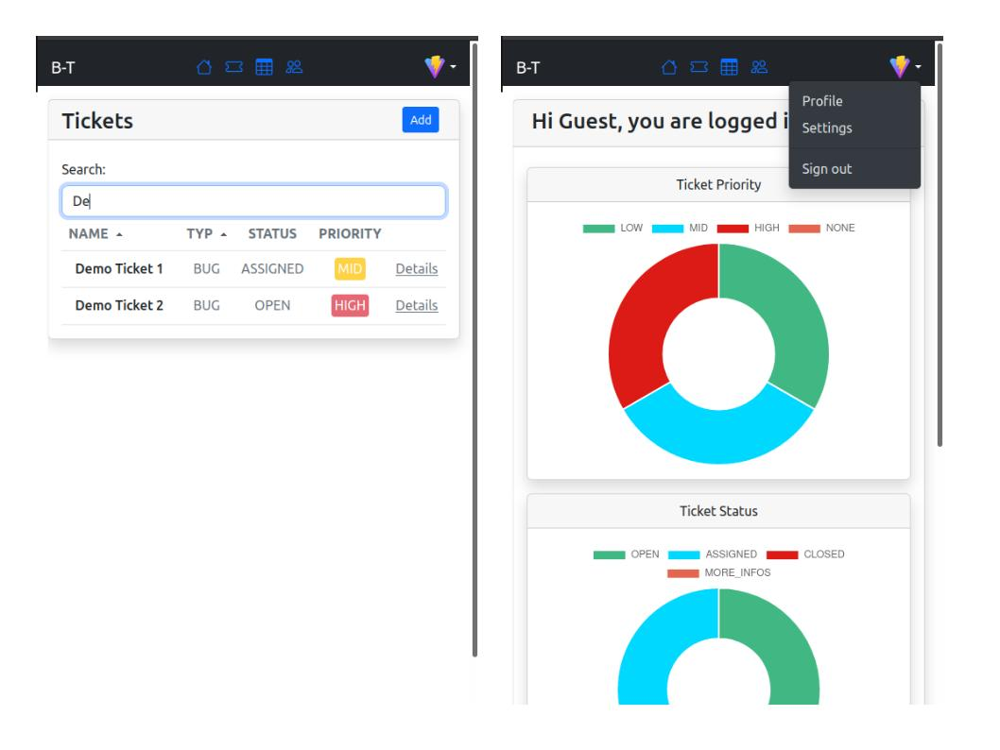

# BugTracker

This is a CRUD web application for tracking bugs, with a MySQL database for data storage and JWT for user authentication. In the application, bug tickets are organized into projects and can be easily created, viewed, edited, and deleted through the MVC Pattern.


Stack: Vue, Vite, Bootstrap, JWT, Java Sring Boot, MySQL 


## Build

Before build you have to add Mysql credentials in application.yml

The application can be built using the following command:

```
./mvnw clean package
```


Node.js is automatically downloaded using the `frontend-maven-plugin` and the final JS/CSS files are integrated into the jar.

The application can then be started with the following command - here with the profile `production`:

```
java -Dspring.profiles.active=production -jar ./target/bug-tracker-0.0.1-SNAPSHOT.jar
```

# Pictures






